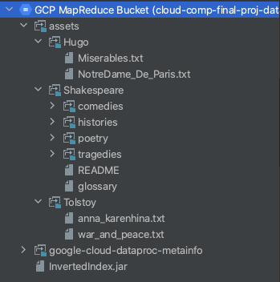

# MapReduceFinalProject

### Video Links:
[Box] (https://pitt.box.com/s/fvgn6ao3nk6s4l7z3eta42bo2c2s3mbk)
[OneDrive]()

### Grading Criteria Met
- [x] Dockerized Search Engine GUI
- [x] Docker to Cluster Communication
- [x] MapReduce Inverted Index Implementation
- [x] Search Term and Top-N Search Implementation

### Requirements:
#### Directory Structure inside Google Storage Bucket
* The way my application copies files to the inpur directory relies on the following structure that was obtained by 
un-compressing the provided data files. 
* The application also assumes that the InvertedIndex.jar file is uploaded to the root directory of the bucket. To do
this, you can either use the `gcloud` command line utility, or use the Google Cloud Console. The InvertedIndex.jar can
be found [here](Jars/InvertedIndex.jar). 

#### Environment Variables
My application relies on the following environment variables, which are already configured in the Dockerfile:
* DISPLAY=10.0.0.242:0
    * The address of my en0 inet6 network adapter that socat and Xquartz uses to display the containerized GUI.
    * To find this address, you can run `ifconfig en0 | grep inet | awk '$1=="inet" {print $2}'` from the terminal and append port 0 to the end. 
* FILE_LIST_PATH=frontend/src/main/resources/srcFiles.txt
    * Path to a hard-coded list of the input files used for input selection
* GOOGLE_APPLICATION_CREDENTIALS=frontend/src/main/resources/credentials/credentials.json
    * Path to the Google Authentication Credentials JSON file for a service account
* PROJECT_ID=cloud-comp-dhfs-cluster
    * The GCP Project ID (and as I'm writing this I see the typo, but that can't be changed now)
* REGION=us-central1
    * The GCP Project Region
* CLUSTER_NAME=cloud-comp-final-proj-cluster
    * The GCP cluster name
* BUCKET_NAME=cloud-comp-final-proj-data
    * The GCP Storage Bucket Name
    
NOTE: The application is dependant on the /assets, /input, and /output directories in the following variables to make 
sure that it does not read results from previous jobs. When editing these, only change the bucket name to ensure 
the data goes in the proper place. 

* BUCKET_ASSET_PATH=cloud-comp-final-proj-data/assets
    * The path to the 'assets' dir on the bucket, as seen in the Directory Structure section above
* JOB_INPUT_DIR=cloud-comp-final-proj-data/input
    * The path to the InvertedIndex job input dir on the bucket
* JOB_OUTPUT_DIR=cloud-comp-final-proj-data/output
    * The path to the InvertedIndex job ouput dir on the bucket
    
NOTE: 
The SearchEngineGUI.jar by itself will not run from the command line since it is dependent on these environment variables, which 
my IDE injects during development. The GUI will run from the docker image, since the vars are configured there. To get
my application running on your own GCP clusters, change the ENV settings of the Dockerfile to point towards your cluster, 
credentials path, etc. Also, the maven build copies my credentials into the JAR, so I have not uploaded that in this repo. 

#### Software Requirements
Requirements:
*    Java 8  
*    Apache Maven 3.6.3
*    Docker: I have Docker Desktop for Mac Version 2.3.0.1(46911)
*    Docker for Mac and Requires `Socat` and `Xquartz` to render a GUI application from within a Container
*    Homebrew for MacOS Package Management

To install socat using homebrew, run `brew install socat`.

To install Xquartz using homebrew, run `brew install xquartz`.

### Build Steps
1. Launch socat: `socat TCP-LISTEN:6000,reuseaddr,fork UNIX-CLIENT:\"$DISPLAY\"`
2. Launch Xquartz: `open -a Xquartz` 
3. In the Xquarts window that opens, naviagate to the Security tab and check `Allow Connections from Network Clients`. 
4. Clone this repository: `git clone https://github.com/StevenMonty/MapReduceSearchEngine.git`
5. Change directory into the cloned repo
6. Add your GCP Credentials JSON file to `frontend/src/main/resources/credentials` and make sure to update its path in the Dockerfile
7. `cd frontent`
8. `mvn install`
9. `mvn package`
10. `docker build --rm -t stevenmonty/gui .`
11. `docker run -it --rm stevenmonty/gui:latest `

### Notes:
 All of my application logic leverages the InvertedIndex results. I use the results to perform both the TopN and 
 SearchTerm operations. 

### Sources Referenced
[Most Common English Words](https://www.espressoenglish.net/the-100-most-common-words-in-english/) used to construct StopWord list

[Secondary Sorting Algorithm](https://www.oreilly.com/library/view/data-algorithms/9781491906170/ch01.html)

[Inverted Index Reference](http://www-scf.usc.edu/~shin630/Youngmin/files/HadoopInvertedIndexV5.pdf)

[Using HDFS from the Java Client Library](https://github.com/googleapis/java-dataproc/blob/master/samples/snippets/src/main/java/SubmitHadoopFsJob.java)

[Google Source Code for Submitting Hadoop Jobs](https://github.com/googleapis/java-dataproc/blob/master/samples/snippets/src/main/java/SubmitJob.java)

[Merging the Hadoop Output Files inside of Java](https://github.com/marcusbeacon/Search-Engine/blob/master/SearchEngine/src/main/java/com/mkb90/app/SearchEngine.java)

[Running Docker GUIs on Mac](https://cntnr.io/running-guis-with-docker-on-mac-os-x-a14df6a76efc)
